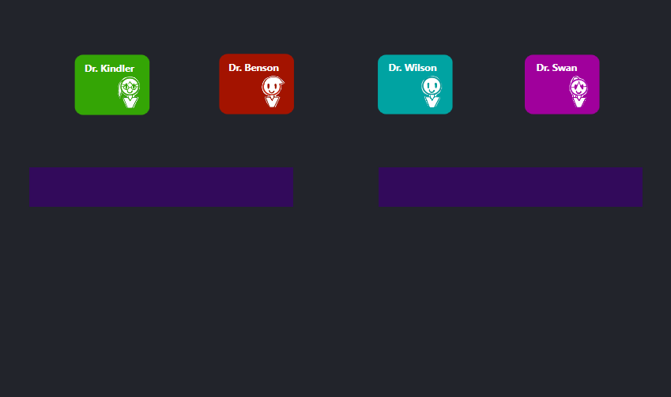
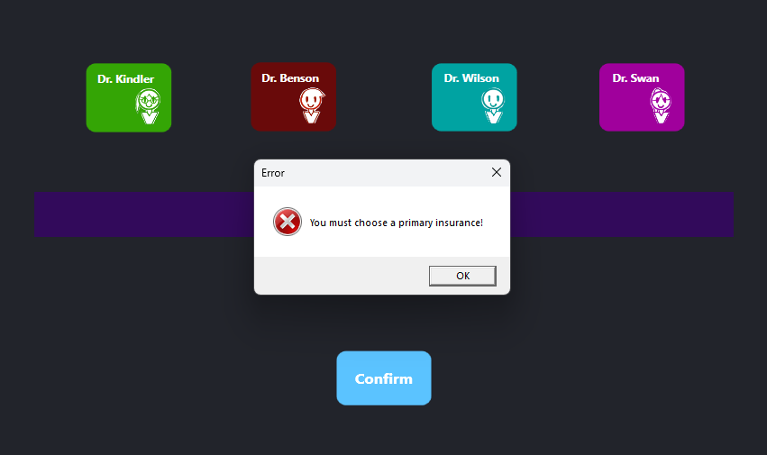
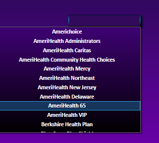
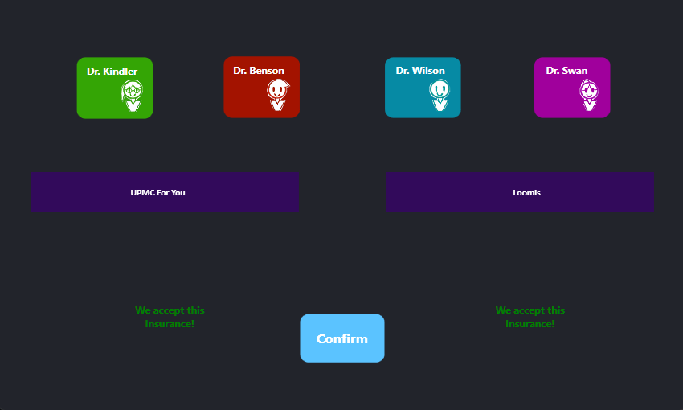
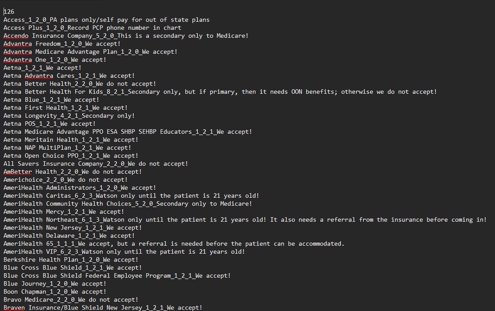
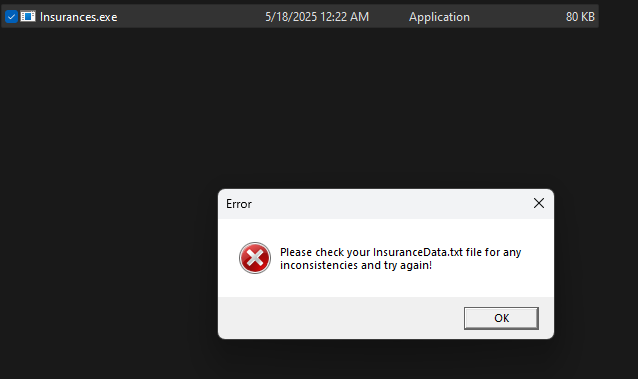

# Insurances
This is a project I made from when I was working as a medical assistant and checking for any patient's insurances. I wanted to create a compact insurance list that can help with any criteria that is needed to accept them in the office. 
For example: some insurances require a few set of conditions in order for them to be seen, such as if they are a pediatric patient, if this is a secondary only to a very specific insurance, or if they have out of network benefits! I made it easier for schedulers to make appointments and verify if we accept any insurance that the patients have. It was a fun little project of mine and it helped me learn so much about insurances.

# How to use
You have four doctors that you can choose from; each with their respected colors: Dr. Kindler is green, Dr.Benson is red, Dr. Wilson is aqua blue, and PA Swan is purple. In the middle section, there are two boxes that if clicked, can show a dropdown list of a variety of insurances. The left one is the primary insurance option, which must be clicked or else it will bring a pop up stating that the patient needs a primary insurance. The right one is the secondary insurance option, which is optional(Keep in mind that if the patient has a secondary insurance, this box must be used for accuracy).
 

 
In this example, I chose my doctor to be Dr. Wilson. As soon as I clicked and made my decision, a button that states "Confirm" suddenly appeared in the screen. Note that if you press the Confirm button without interacting with the primary insurance box, you will get an error that states that you must choose a primary insurance before moving forward. A screenshot of that happening is shown here.
 

 
To choose your primary insurance, you must click on the box on the left side of the screen. Once you do, it will show a dropdown list of all of the available insurances that are listed in a text file called "InsuranceData.txt". 
 

 
Once you pick a primary insurance that the patient has, you are ready to press the confirm button to see if they accept the insurance with this doctor. In my example, I chose "UPMC For You" as the primary insurance and "Loomis" as the secondary insurance. Simple as that! That's all there is to it!
 

 
# Insurance Data
There is another file that is needed in order for the program to start: "InsuranceData.txt". This is where the list of insurance names and specifications are stored. If you open the file, you can see a plethora of different insurances, with a number all the way on the top. The number signifies how many insurances are in the dropdown list once you start the program. If the number has a letter or the number is above the list, the program will pop an error when you start it up, telling you that there might be some inconsistencies within the text file. You need the Insurance Data file in order for the program to work. You can also make your own, but make sure it is called "InsuranceData.txt".
 

 
Within this file, you may notice that there is the insurance name, underscores, numbers, and a description. The underscores are what keeps things separate from their meanings. I will explain what these means and how this work by going step by step, but I will show you the simplistic version of this by showing an example.
 

 
# Step 1: Insurance Name
This is where you put the name of the insurance. Make sure you add an underscore after each step to make this work. If not, then the program will have an error.

 
# Step 2: The Condition of The Insurance.
This is where you put the number, each having a meaning to it.
 
0 = I am not sure if we do accept this. Please speak to your Billing Department or Office Administrator for more details!
 
1 = We accept this insurance!
 
2 = We do not accept this insurance!
 
3 = Does the patient have any Out Of Network benefits? This will bring a pop up that will ask you to pick Yes or No.
 
4 = This insurance must be a secondary only...
 
5 = This insurance must be a secondary only to Medicare...
 
6 = Is this a pediatric patient(20 or younger)? This will bring a pop up that will ask you to pick Yes or No.
 
7 = Insurance needs to be a PA Plan. Does this insurance have an insurance plan? This will bring a pop up that will ask you to pick Yes or No.
 
8 = This is a secondary only insurance, but it may be accepted if it has OON benefits. Does it have OON benefits? This will bring a pop up that will ask you to pick Yes or No.
