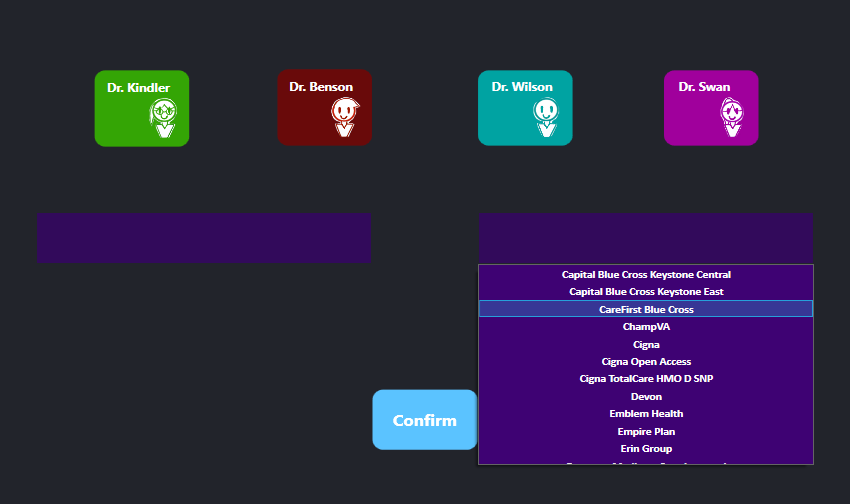

# Insurances
This is a project I made from when I was working as a medical assistant and checking for any patient's insurances. I wanted to create a compact insurance list that can help with any criteria that is needed to accept them in the office. 
For example: some insurances require a few set of conditions in order for them to be seen, such as if they are a pediatric patient, if this a secondary only to a very specific insurance, or if they have out of network benefits! I made it easier for schedulers to make appointments and verify if we accept any insurance that the patients have. It was a fun little project of mine and it helped me learn so much about insurances.

# How to use
 
You have four doctors that you can choose from; each with their respected colors: Dr. Kindler is green, Dr.Benson is red, Dr. Wilson is aqua blue, and PA Swan is purple. In the middle section, there are two boxes that if clicked, can show a dropdown list of a variety of insurances. The left one is the primary insurance option, which must be clicked or else it will bring a pop up stating that the patient needs a primary insurance. The right one is the secondary insurance option, which is optional(Keep in mind that if the patient has a secondary insurance, this box must be used for accuracy).
 

 
In this example, I chose my doctor to be Dr. Wilson. As soon as I clicked and made my decision, a button that states "Confirm" suddenly appeared in the screen. Note that if you press the Confirm button without interacting with the primary insurance box, you will get an error that states that you must choose a primary insurance before moving forward. A screenshot of that happening is shown here.
 

 
To choose your primary insurance, you must click on the box on the left side of the screen. Once you do, it will show a dropdown list of all of the available insurances that are listed in a text file called "InsuranceData.txt". 
 

 
Once you pick a primary insurance that the patient has, you are ready to press the confirm button to see if they accept the insurance with this doctor. In my example, I chose "UPMC For You" as the primary insurance and "Loomis" as the secondary insurance. Simple as that!
 
